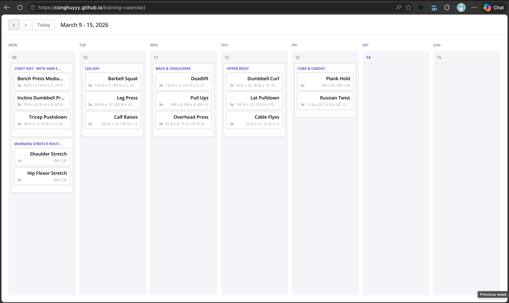
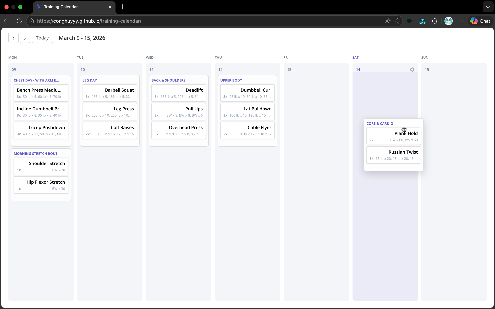
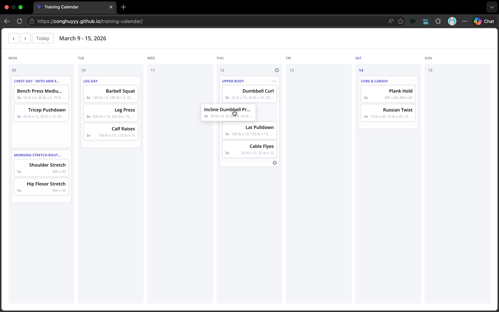
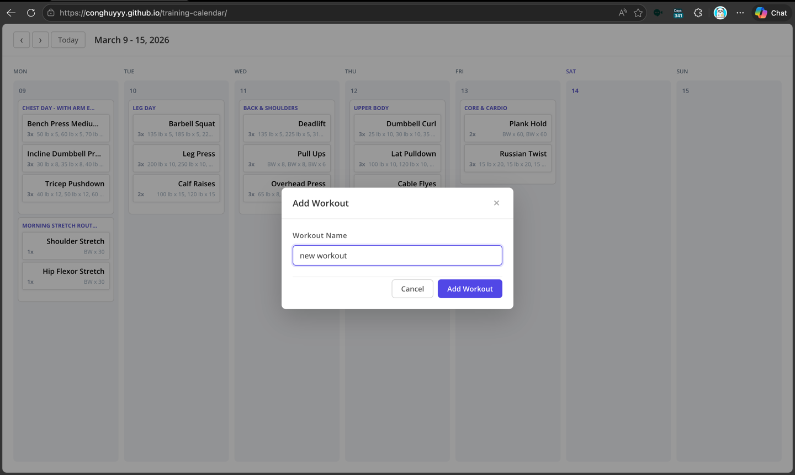
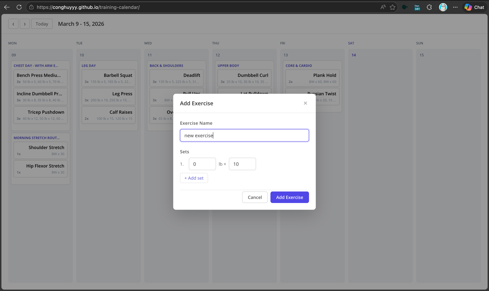

# Training Calendar

A weekly training calendar built with **React 19**, **TypeScript** and **Vite**. Users can manage workouts and
exercises through an intuitive drag-and-drop interface.

## Live Demo

👉 [https://conghuyyy.github.io/training-calendar](https://conghuyyy.github.io/training-calendar)

## Screenshots

### Weekly calendar view



### Dragging a workout card



### Dragging an exercise



### Add new workout



### Add new exercise



## Features

- **Weekly calendar view** — navigate between weeks with previous/next buttons or jump to today
- **Drag & drop workouts** — reorder workouts within a day or move them across days
- **Drag & drop exercises** — reorder exercises within a workout or move them between workouts
- **CRUD workouts** — add, edit and delete workouts via modal forms
- **CRUD exercises** — add, edit and delete exercises with configurable sets (weight × reps)
- **Empty state** — workout cards display a placeholder when no exercises are added yet
- **Today highlight** — the current day column is visually emphasized
- **Lazy-loaded modals** — `WorkoutModal` and `ExerciseModal` are code-split with `React.lazy`
- **Keyboard accessible** — modals close on `Escape`, buttons are focusable

## Getting Started

### Prerequisites

- **Node.js** ≥ 18
- **pnpm** ≥ 9

### Install & Run

```bash
# Clone the repository
git clone https://github.com/conghuyyy/training-calendar.git
cd training-calendar

# Install dependencies
pnpm install

# Start development server
pnpm dev
```

Open [http://localhost:5173/training-calendar/](http://localhost:5173/training-calendar/) in your browser.

### Other Commands

| Command          | Description                  |
| ---------------- | ---------------------------- |
| `pnpm build`     | Production build to `dist/`  |
| `pnpm preview`   | Preview the production build |
| `pnpm lint`      | Run ESLint                   |
| `pnpm typecheck` | Run TypeScript type checking |
| `pnpm format`    | Format code with Prettier    |

## Key Design Decisions

1. **No external state management** — React `useState` at the `TrainingCalendar` root is sufficient for the current
   scope. State is lifted just high enough and passed down via props.

2. **BEM + CSS custom properties** — keeps styling predictable, scoped by convention and easily themeable without a
   CSS-in-JS runtime.

3. **Shared form styles** — common modal form CSS (inputs, buttons, layout) is extracted into `ModalForm.css` to
   eliminate duplication between workout and exercise forms.

4. **Custom hooks for separation of concerns** — drag-and-drop, week navigation and modal CRUD are each isolated into
   their own hook, keeping the root component clean.

5. **Code splitting** — modals are lazy-loaded since they're not needed on initial render, reducing the initial bundle
   size.

## Notes

This project was built with the assistance of an **AI coding agent** (GitHub Copilot) to speed up development. Due to time constraints, the codebase may not be fully optimized or refactored to production-grade standards — there is room for improvement in areas such as optimizing unnecessary re-renders, memoization, component decomposition, and general performance tuning.

## Assumptions

- The calendar displays one week at a time (Monday–Sunday).
- All data is in-memory only — refreshing the page resets to the seed data.
- Exercises are scoped to individual workouts (not shared/reused across workouts).
- Weight is in **lb** and defaults to `0` (bodyweight) for new sets.
